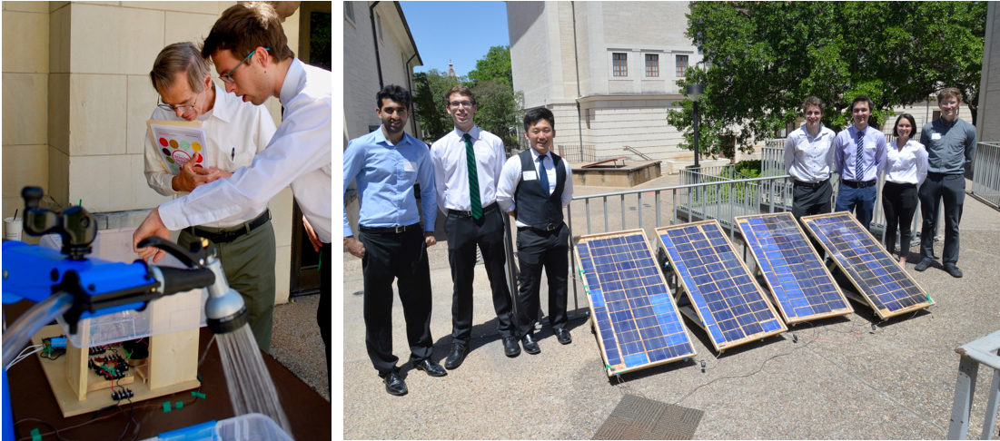

## Solar Powered Water Pump

*Collaborators: Schuyler Christensen, Max Granat, Cody Scarborough, Ji Seon, Ankit Sharma, Carly Stalder*

*Advisor: [Prof. Ross Baldick](https://users.ece.utexas.edu/~baldick/)*

*University of Texas at Austin*

**Abstract:** For rural and underserved communities, in addition to other scenarios where access to grid power is limited, there exists a need for self-sufficient systems to deliver energy for a variety of applications. As the scientific community continues to develop renewable technology, the price of solar cells will follow to decline. This has made solar energy an increasingly attractive source of power, especially for small operations. This project develops a system capable of receiving solar power from photovoltaic panels and producing mechanical energy in in the form of air conditioning units or water pumps. Additional criteria for our project includes independent operation from an electric grid and the ability to drive a variable frequency motor under various solar levels without stalling. As the project is off-grid and avoids the purchase of any energy storage, the system also has to instantaneously use any power produced by the solar panels. Safety, cost and functionality were a priority of our design, given the desire of making the project open source so it can be built in this underserved and isolated areas.

* [Report](Jluengo_BScReport.pdf)
* [Poster](JLuengo_BscPoster.pdf)
* [Ross Baldick's Article](http://rossbaldick.com/pumping-water-uphill-storing-energy-without-batteries/)

  

    <iframe
     frameborder="0"
     allowfullscreen=""
     src="https://www.youtube.com/embed/yR667h2FNRA">
     </iframe>
  

