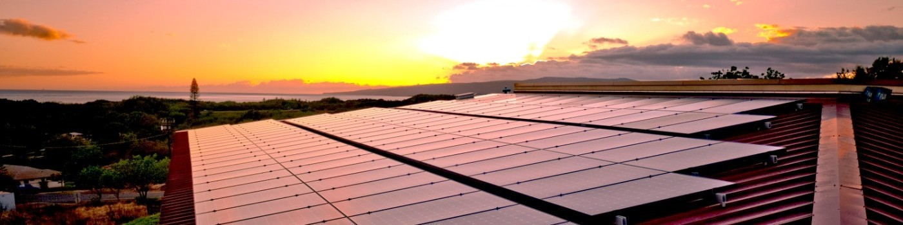

## State Estimation for Unobservable Distribution Systems via Deep Neural Networks 

*Collaborators: Kursat Rasim Mestav*
*Advisor: Prof. Lang Tong*
State estimation

* [Report](JLuengo_MEngReport.pdf)
* [Poster](JLuengo_MEngPoster.pdf)